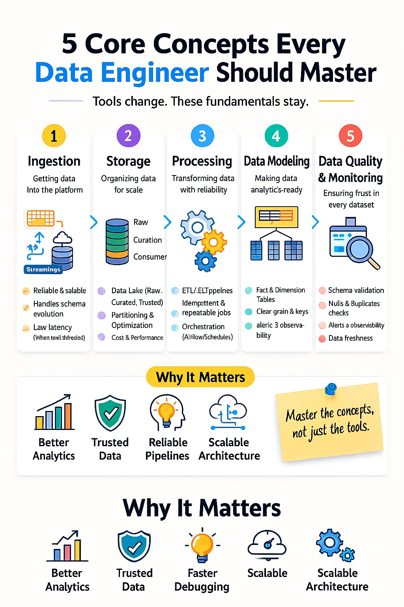
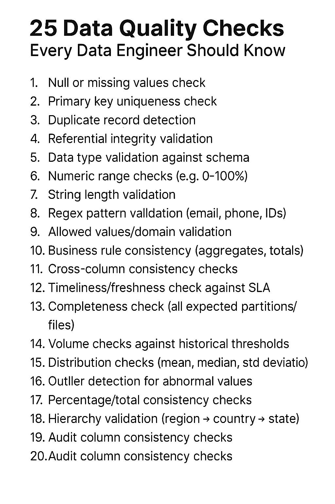

# Data-SQL-Airflow-AI

# 🧠 Open Fiber – Data Office Mind Map (Allineamento Interno)








## 1. 🎯 Big Picture (الفكرة الكبرى)

تحول الشركة من:

* مزود ألياف ضوئية (Fiber Infrastructure)

إلى:

* منصة بنية تحتية رقمية (Digital Platform Provider)

تشمل:

* Edge Computing
* Cloud / Data Services
* IoT Platforms
* Application Hosting
* Data Monetization

---

## 2. 🏗️ Digital Infrastructure Layer

### Components:

* Fiber Network
* Data Centers
* Edge Nodes
* Cloud Integration
* Software Layers (Virtualization)

📌 الهدف:
فصل الـ hardware عن الـ software عبر طبقات برمجية

---

## 3. ⚡ Edge / Data Center / Computing

### 🏢 Data Center

* مراكز مركزية
* تخزين ومعالجة البيانات

### 🌐 Edge Computing

* معالجة قريبة من المستخدم
* Low latency
* Use cases:

  * IoT
  * Video surveillance
  * Remote surgery

### 🧠 Computing

* القدرة الحاسوبية (CPU/GPU/Cloud)

---

## 4. 🧩 Network Evolution

* Network → Software Defined Network
* Automation:

  * Self-configuring
  * Self-healing
  * Auto provisioning

📌 الهدف:
شبكة ذكية + تقليل التدخل البشري

---

## 5. ☁️ Hyperscalers

أكبر مزودي Cloud:

* AWS (Amazon)
* Azure (Microsoft)
* Google Cloud

📌 خصائص:

* قابلية توسع ضخمة
* قوة مالية عالية
* سيطرة على السوق العالمي

---

## 6. 🔐 Digital Sovereignty

📌 الفكرة:

* البيانات داخل الدولة
* تقليل الاعتماد على مزودي أمريكيين

📌 الهدف:

* حماية استراتيجية
* استقلالية البيانات

---

## 7. 📺 CDN (Content Delivery Network)

* توزيع المحتوى بالقرب من المستخدم
* تحسين السرعة

أمثلة:

* Netflix
* Video streaming

---

## 8. 💰 Business Model Transformation

* من Infrastructure فقط
  → إلى Platform Economy

📌 أمثلة:

* Hosting applications for PA & enterprises
* Edge services monetization
* Data monetization

---

## 9. 📊 IT Budget Model

### Run / Grow / Transform

#### 🟢 Run

* تشغيل الأنظمة
* صيانة
* تراخيص

#### 🔵 Grow

* تطوير وتحسين
* ميزات جديدة

#### 🔴 Transform

* تغيير الأنظمة بالكامل
* مثال:

  * Postgres → Snowflake
  * Legacy → Salesforce

---

## 10. ⚙️ Operational Model (Delivery & Assurance)

* 4000 activations/day
* Civil addresses management
* Delivery critical path
* Penalties & revenue impact

📌 الشركة تتحكم في:

* activation
* delivery
* assurance
* external reporting

---

## 11. 📡 External Stakeholders

* AGCOM (regulator)
* Invitalia (public funding)

📌 Requirement:

* data export
* compliance
* reporting

---

## 🧩 Final Summary

Open Fiber is evolving into:

👉 A national digital infrastructure platform
that integrates:

* Network
* Cloud
* Edge
* Data
* Applications
* Regulation layer

---

💡 Core idea:
"From fiber operator → Digital platform ecosystem"


# Apache Spark & PySpark -- Introduction Guide

## أولًا: ما هو Apache Spark ؟

Spark هو إطار عمل لمعالجة البيانات الضخمة (Big Data processing engine).

يعني: بدل ما تعالج بيانات صغيرة على جهازك فقط → Spark يسمح لك تعالج
بيانات ضخمة جدًا موزعة على عدة أجهزة بسرعة عالية.

يستخدم في:

-   Data Engineering
-   Machine Learning
-   Streaming
-   ETL pipelines
-   Analytics

### مثال:

بدل:

``` sql
SELECT * FROM table
```

على جهاز واحد

Spark يعمل نفس الشيء لكن على ملايين أو مليارات الصفوف موزعة على cluster.

------------------------------------------------------------------------

## ثانيًا: ما هو PySpark ؟

PySpark = Spark باستخدام Python

يعني:

Spark أصله مكتوب بـ:

-   Scala (اللغة الأساسية)

لكن يوجد APIs:

  Language   API
  ---------- ----------------
  Python     PySpark
  Scala      Spark native
  Java       Spark Java API
  SQL        Spark SQL

إذا كنت تستخدم Python → أنت تستخدم PySpark

### مثال:

``` python
df = spark.read.csv("data.csv")
df.show()
```

------------------------------------------------------------------------

## ثالثًا: مكونات Spark الأساسية (Spark Components)

Spark يتكون من عدة modules:

### 1️⃣ Spark Core

هو الأساس

مسؤول عن:

-   memory management
-   scheduling
-   distributed execution

------------------------------------------------------------------------

### 2️⃣ Spark SQL

يشغل SQL على البيانات الكبيرة

مثال:

``` python
spark.sql("SELECT * FROM table")
```

------------------------------------------------------------------------

### 3️⃣ Spark DataFrame API

مثل Pandas لكن للبيانات الكبيرة

مثال:

``` python
df.select("name")
```

------------------------------------------------------------------------

### 4️⃣ Spark Streaming

معالجة البيانات المباشرة (real-time)

مثال:

-   Kafka
-   sensors
-   logs

------------------------------------------------------------------------

### 5️⃣ Spark MLlib

Machine Learning library

مثل:

-   classification
-   clustering
-   regression

------------------------------------------------------------------------

### 6️⃣ GraphX

للشبكات والعلاقات graph analysis

------------------------------------------------------------------------

## الآن السؤال المهم 👇

ما علاقة Spark مع هذه الأدوات الأخرى؟

خلينا نرتبها بشكل منطقي في الجزء القادم

# README.md

# Apache Spark Ecosystem — Complete Beginner Guide 🚀

الآن السؤال المهم 👇

**ما علاقة Apache Spark مع الأدوات الأخرى في عالم الـ Data Engineering؟**

هذا الدليل يوضح الصورة الكاملة بطريقة منظمة وسهلة.

---

# ما هو Apache Hadoop ؟

**Hadoop = نظام تخزين ومعالجة بيانات ضخمة (Big Data Infrastructure)**

يتكون من 3 أجزاء رئيسية:

| Component | الوظيفة                     |
| --------- | --------------------------- |
| HDFS      | تخزين البيانات              |
| YARN      | إدارة الموارد داخل الكلاستر |
| MapReduce | محرك المعالجة القديم        |

قديماً:

MapReduce كان هو المسؤول عن معالجة البيانات.

اليوم:

Spark استبدله تقريباً لأنه أسرع وأسهل.

---

# العلاقة بين Hadoop و Spark

Spark يعمل فوق Hadoop وليس بدلاً عنه بالكامل.

مثال عملي:

```
Spark → processing engine
HDFS → storage layer
YARN → cluster manager
```

بمعنى:

```
Hadoop = Infrastructure
Spark = Processing Engine
```

---

# ما هو Data Lake ؟

**Data Lake = مكان تخزين البيانات الخام بدون Structure صارم**

يشبه:

Google Drive لكن للبيانات 📂

يمكن أن يحتوي:

```
csv
json
parquet
logs
images
videos
tables
```

Spark يستخدم Data Lake عادة بهذه الطريقة:

```
Spark reads from Data Lake
Spark processes data
Spark writes results back
```

---

# ما هو Databricks ؟

Databricks = منصة مبنية فوق Spark

ببساطة:

```
Spark + Tools + Cloud Platform
```

بدلاً من:

تنصيب Cluster بنفسك

Databricks يوفر:

* Spark cluster جاهز
* Notebooks
* Machine Learning tools
* SQL Analytics
* Delta Lake support

اليوم يعتبر الأكثر استخداماً في الشركات الحديثة ⭐

---

# ما هو Apache Hive ؟

Hive = SQL فوق Hadoop

يسمح لك بكتابة:

```
SELECT *
FROM table
```

ويعمل مباشرة فوق:

```
HDFS
```

Spark يستطيع تشغيل Hive مباشرة باستخدام:

```
Spark SQL with Hive support
```

---

# ما هو Cloudera Impala ؟

Impala = SQL Engine سريع جداً

يشبه Hive لكن أسرع منه.

مقارنة سريعة:

| Tool      | Speed      |
| --------- | ---------- |
| Hive      | بطيء       |
| Impala    | سريع       |
| Spark SQL | أسرع وأقوى |

---

# ما هو Cloudera ؟

Cloudera = منصة Enterprise تجمع أدوات Hadoop Ecosystem في مكان واحد

تشمل:

```
Hadoop
Hive
Impala
Spark
Security tools
Cluster management
```

بمعنى:

Enterprise Distribution جاهزة للاستخدام داخل الشركات.

---

# الصورة الكاملة للـ Architecture 🧠

عادة الشركات تعمل بهذا الشكل:

```
Data Sources
     ↓
Data Lake (HDFS / S3 / Azure Data Lake)
     ↓
Spark Processing
     ↓
Hive / Impala / Databricks SQL
     ↓
Dashboards / Machine Learning / Reports
```

هذه هي Pipeline الكلاسيكية في أغلب الشركات.

---

# متى تستخدم كل أداة ؟

| Tool       | الاستخدام                |
| ---------- | ------------------------ |
| Spark      | معالجة البيانات الضخمة   |
| PySpark    | استخدام Spark عبر Python |
| Hadoop     | تخزين البيانات           |
| Hive       | SQL فوق Hadoop           |
| Impala     | SQL سريع جداً            |
| Databricks | Spark Platform على Cloud |
| Data Lake  | Storage Architecture     |

---

# نصيحتي لك شخصياً يا محمد 🎯

بما أنك تعمل حالياً في:

* SQL
* Airflow
* AI
* Data Pipelines

أفضل Roadmap لك:

```
Spark SQL
↓
PySpark DataFrames
↓
Spark + Airflow Integration
↓
Delta Lake
↓
Databricks
```

هذا المسار مطلوب جداً في وظائف:

* Data Engineer
* ML Engineer
* Analytics Engineer

---

إذا تحب، أجهز لك **Roadmap تدريب لمدة 30 يوم** خطوة بخطوة لتعلم Spark بطريقة عملية مثل خطة شركات التدريب الحقيقية 📅🔥


.المحتوى الذي شاركته ممتاز جدًا 👌 وهو فعلاً من أهم المفاهيم في Data Engineering. خليني أشرح لك الفرق بطريقة عملية وبسيطة — خصوصًا بما أنك تعمل في SQL وAirflow وAI فهذا الموضوع مهم جدًا لمسارك المهني يا محمد 📊🚀

الفرق الأساسي بين Data Lake و Data Warehouse

الفكرة ببساطة:

Data Lake	Data Warehouse
مخزن بيانات خام	مخزن بيانات منظمة
مرن جدًا	سريع جدًا
رخيص	أغلى
مناسب ML	مناسب BI

خليني أوضحها بمثال حقيقي 👇

تخيّل شركة اتصالات مثل OpenFiber أو TIM 📡

الشركة لديها بيانات مثل:

Logs من الشبكة
صور
ملفات JSON
CSV
بيانات العملاء
بيانات الفواتير
بيانات sensors

السؤال:

أين نضع هذه البيانات؟

الجواب يعتمد على الهدف.

أولًا: ما هو Data Lake؟ 🌊

Data Lake = تخزين كل شيء كما هو

بدون تنظيف
بدون تنظيم
بدون تحويل

مثال:

logs.json
customers.csv
images/
sensor_stream/
network_data.xml


كلها تدخل مباشرة.

ميزة قوية جدًا:

يمكنك لاحقًا استخدامها لأي شيء:

Machine Learning
Analytics
AI models
Data exploration
لماذا اسمه Schema-on-Read ؟

يعني:

البيانات تُفسَّر عند القراءة وليس عند التخزين

مثال:

اليوم تستخدم JSON كـ ML dataset
غدًا تستخدمه كـ analytics table

نفس الملف 👍

ثانيًا: ما هو Data Warehouse؟ 🏭

Data Warehouse = بيانات نظيفة ومنظمة

قبل دخول البيانات:

تمر بمرحلة

ETL

يعني:

Extract
Transform
Load


مثال:

بدل:

customer_data.json


يصبح:

customer_table


منظم داخل:

rows
columns
relations
indexes

لماذا Schema-on-Write ؟

يعني:

الهيكل يتم تعريفه قبل التخزين

مثال:

CREATE TABLE customers


ثم تدخل البيانات.

الفرق الحقيقي في الاستخدام
Data Lake يستخدم عندما:

تريد:

Machine Learning
Deep Learning
AI
Big Data processing
Logs analysis
Streaming analytics

مثال:

Spark + Data Lake

Data Warehouse يستخدم عندما:

تريد:

Dashboards
Power BI
Tableau
SQL analytics
KPI reports

مثال:

monthly revenue
customer churn rate
network usage stats

ماذا تستخدم الشركات الحديثة اليوم؟

الجواب:

Data Lakehouse

وهو مزيج بين الاثنين 👇

ما هو Data Lakehouse ؟ 🧠

يجمع:

مرونة Data Lake
+
سرعة Data Warehouse

مثال أدوات تعمل بهذه الفكرة:

Spark
Delta Lake
Databricks

يعني:

تخزن البيانات خام
لكن تستطيع تشغيل SQL سريع عليها

Architecture حديثة في الشركات عادة تكون هكذا
Data Sources
    ↓
Data Lake
(S3 / HDFS)
    ↓
Spark processing
    ↓
Lakehouse tables
(Delta)
    ↓
BI dashboards + ML models

أين أنت الآن في هذا العالم يا محمد؟ 🎯

بناءً على شغلك الحالي:

أنت تعمل مع:

SQL
Data Quality
Pipelines
Airflow

غالبًا أنت أقرب إلى:

Data Warehouse layer


لكن إذا تعلمت:

Spark
PySpark
Delta Lake
Databricks

ستنتقل إلى مستوى:

Modern Data Engineer


وهذا مطلوب جدًا في سوق العمل في إيطاليا الآن 🇮🇹

إذا تحب، أشرح لك مثال عملي حقيقي يوضح كيف تتحرك البيانات من Data Lake → Spark → Data Warehouse → Dashboard خطوة بخطوة مثل ما يحدث داخل الشركات.

ETL 
LTE
REVERSE ETL 

سأشرح لك الثلاثة مفاهيم بشكل واضح ومترابط لأنهم جزء أساسي من Data Engineering Architecture الحديثة، خصوصًا أنك تعمل في SQL وAirflow وData pipelines يا محمد — وهذه مهارات مباشرة مطلوبة في وظائف Data Engineer 🚀

أولًا: ما هو ETL ؟

ETL = Extract → Transform → Load

وهو الشكل الكلاسيكي لنقل البيانات إلى Data Warehouse

يعني:

Data Sources → تنظيف البيانات → إدخالها إلى Data Warehouse

الخطوات بالتفصيل
1️⃣ Extract (استخراج البيانات)

نسحب البيانات من مصادر مختلفة:

مثل:

databases
APIs
CSV files
logs
ERP systems

مثال:

SELECT * FROM customers

2️⃣ Transform (تنظيف وتحويل البيانات)

نقوم بـ:

حذف القيم الفارغة
توحيد التاريخ
إزالة التكرار
تغيير format
join بين الجداول

مثال:

"2024/01/01" → "2024-01-01"

3️⃣ Load (تحميل البيانات)

نضع البيانات داخل:

Data Warehouse

مثل:

PostgreSQL
BigQuery
Snowflake
Redshift
مثال عملي قريب من شغلك

في OpenFiber مثلًا:

network tables
customer tables
circuits tables


تمر بعملية:

Extract from sources
Transform cleaning
Load into analytics tables


ثم تستخدم في:

Power BI
reports
dashboards

ثانيًا: ما هو ELT ؟

ELT = نسخة حديثة من ETL

الفرق:

بدل تنظيف البيانات أولًا
نخزنها مباشرة ثم ننظفها لاحقًا

يعني:

Extract → Load → Transform

لماذا ظهر ELT ؟

لأن أدوات حديثة مثل:

Spark
Databricks
BigQuery

أصبحت قوية جدًا

فأصبح ممكن:

نخزن البيانات أولًا
ثم نعالجها داخل Data Lake أو Warehouse

الفرق الحقيقي بين ETL و ELT
ETL	ELT
Transform قبل التخزين	Transform بعد التخزين
قديم	حديث
مناسب Data Warehouse	مناسب Data Lake
أبطأ scalability	أسرع scalability

اليوم أغلب الشركات تستخدم:

ELT

ثالثًا: ما هو Reverse ETL ؟

Reverse ETL = عكس ETL

بدل إدخال البيانات إلى Data Warehouse
نخرج البيانات منه إلى الأنظمة التشغيلية

يعني الاتجاه يصبح:

Data Warehouse → Business tools

مثال بسيط جدًا

داخل Data Warehouse يوجد:

customer churn probability


نرسل هذه النتيجة إلى:

CRM
Marketing tools
Sales platform

حتى يستخدمها الفريق مباشرة

مثال عملي حقيقي

Pipeline تقليدي:

Database → Data Warehouse


Reverse ETL:

Data Warehouse → Salesforce / CRM / Email automation

لماذا Reverse ETL مهم جدًا اليوم؟

لأنه يسمح:

للـ AI و analytics

أن تؤثر مباشرة على القرار داخل الشركة

مثال:

Model يتوقع:

customer will leave soon


Reverse ETL يرسل النتيجة إلى:

CRM

فيقوم النظام تلقائيًا بإرسال عرض للعميل 🎯

الصورة الكاملة الحديثة للـ Data Pipelines

الشركات الحديثة تعمل هكذا:

Sources
 ↓
ETL / ELT
 ↓
Data Lake / Warehouse
 ↓
ML models
 ↓
Reverse ETL
 ↓
CRM / dashboards / apps

أين يظهر دورك أنت تحديدًا يا محمد؟

من شغلك الحالي في:

SQL
Data Quality
pipelines
Cloudera environment

أنت بالفعل تعمل داخل:

ETL layer


ولو تعلمت:

Spark
PySpark
Airflow advanced pipelines
Reverse ETL tools

ستصبح:

Modern Data Engineer كامل stack تقريبًا 💪📊


# Elasticsearch --- Quick Guide

## What is Elasticsearch?

Elasticsearch is a **fast search and analytics engine** designed to work
with **large volumes of data in near real time**.

Think of it like **Google for your company's internal data** 🔎

Instead of searching the internet, Elasticsearch searches inside:

-   System logs
-   Databases
-   User files
-   Large text datasets
-   Application data
-   Sensor / IoT data
-   AI embeddings

------------------------------------------------------------------------

## Why Elasticsearch is Fast

Traditional SQL databases can be slower when searching inside millions
of rows.

Elasticsearch performs searches in **milliseconds ⚡** because it uses:

**Apache Lucene**

Lucene is a powerful full‑text search engine library optimized for
speed.

------------------------------------------------------------------------

## Example

Example logs:

User login success User login failed Server error 500 Payment completed

Search query:

error

Elasticsearch returns results almost instantly.

------------------------------------------------------------------------

## How Elasticsearch Stores Data

Instead of tables like SQL databases, Elasticsearch uses JSON documents.

  SQL Concept   Elasticsearch Equivalent
  ------------- --------------------------
  Database      Index
  Table         Document
  Row           JSON document

Example document:

``` json
{
  "user": "Mohammad",
  "action": "login",
  "status": "success"
}
```

All data is stored in JSON format.

------------------------------------------------------------------------

## Where Elasticsearch is Used in Companies

Elasticsearch is commonly used with a popular stack called:

## ELK Stack

The ELK Stack includes:

-   **Elasticsearch** → storage and search engine
-   **Logstash** → data ingestion pipeline
-   **Kibana** → visualization dashboards

Example workflow:

Logs → Logstash → Elasticsearch → Kibana dashboard 📊

This setup allows companies to monitor errors and system activity in
real time.

# Elasticsearch vs Data Warehouse (BigQuery & Snowflake)

## 📌 Overview

This document explains the difference between **Elasticsearch** and **Data Warehouses** like **Google BigQuery** and **Snowflake** in a simple and practical way.

---

## 🎯 Core Idea

| Tool                 | Purpose                           |
| -------------------- | --------------------------------- |
| Elasticsearch        | Real-time search + log analysis   |
| BigQuery / Snowflake | Large-scale analytics + reporting |

---

## ⚡ Simple Definition

* **Elasticsearch** = Realtime search engine for fast queries on logs and text
* **Data Warehouse** = System for structured analytics and business intelligence

---

## 🧠 Use Cases

### Elasticsearch is used for:

* Logs monitoring
* Full-text search
* Realtime dashboards
* Error tracking systems
* Autocomplete systems
* Observability (metrics/logs/traces)

### Data Warehouse is used for:

* Business reporting
* BI dashboards
* Historical analysis
* Data aggregation at scale
* SQL-based analytics
* Machine Learning feature engineering

---

## ⚖️ Key Differences

### 1. Purpose

* Elasticsearch → Fast search & realtime insights
* Data Warehouse → Deep analytics & reporting

### 2. Data Type

* Elasticsearch → Semi-structured (JSON documents)
* Data Warehouse → Structured (tables, rows, columns)

### 3. Query Type

* Elasticsearch → Search queries + aggregations
* Data Warehouse → SQL queries

### 4. Performance Focus

* Elasticsearch → Low latency (milliseconds)
* Data Warehouse → High throughput (large datasets)

---

## 📊 Example Comparison

### Query Example 1

**Find error message in logs (last 1 minute)**

* Elasticsearch → ⚡ Very fast

### Query Example 2

**Count errors per country over 6 months**

* BigQuery / Snowflake → 📊 Best choice

---

## 🏗️ Data Storage Model

### Elasticsearch

* Document-based
* JSON structure
* Indexes + mappings

### Data Warehouse

* Table-based
* SQL schema
* Columns + relations

---

## 🔥 Do They Replace Each Other?

❌ No

They are **complementary tools**, not competitors.

---

## 🔄 Real Production Architecture

```
Application Logs
      ↓
Data Pipeline (Airflow / Kafka / Logstash)
      ↓
Elasticsearch → Realtime search & monitoring
      ↓
Data Warehouse → Analytics & reporting
```

---

## 🏢 Real Company Example

A modern tech company typically uses:

### Elasticsearch

* System monitoring
* Log analysis
* Search features in apps

### Snowflake / BigQuery

* Revenue dashboards
* User analytics
* Business intelligence
* Machine learning datasets

---

## 🎯 Interview Answer (Short)

> Elasticsearch is used for real-time search and log analytics, while Data Warehouses like BigQuery and Snowflake are used for large-scale structured analytics and business reporting using SQL. They are complementary systems used together in modern data architectures.

---

## 🚀 Data Engineer Insight

If you already know SQL, Airflow, and pipelines:

👉 Learning Elasticsearch makes you a **strong Modern Data Engineer** because you cover:

* Batch processing (Data Warehouse)
* Real-time systems (Elasticsearch)

---

## 📌 Summary

* Elasticsearch = Real-time + search
* Data Warehouse = Analytics + reporting
* Best practice = Use both together


# 📘 Open Fiber Data Architecture Explanation (Elasticsearch, Kafka, Databricks)

## 🧠 Overview

This document explains how large-scale infrastructure companies like Open Fiber handle:
- Search
- Data streaming
- Data processing
- Analytics

using modern data tools:

- Elasticsearch
- Kafka
- Databricks

---

# 🔎 1. Elasticsearch

## What is it?

Elasticsearch is a:
- Search engine
- Real-time indexing system
- Fast query engine

## Where it is strong

✔ Full-text search  
✔ Fast filtering (queries in milliseconds)  
✔ Autocomplete  
✔ Aggregations (counts, grouping)

## Example use cases

- Searching buildings
- Searching addresses (civici)
- Searching POIs
- Fast UI search in dashboards

## Important limitation

❌ Not a relational database  
❌ No real JOINs  
❌ Eventual consistency  
❌ Not suitable as system of truth  

---

## Why Open Fiber does NOT use it as main DB?

Open Fiber works with:

- Buildings
- Civici (addresses)
- Cables
- Network segments

These require:

- Strong relationships (relational integrity)
- Consistency rules
- Versioning and history

👉 Elasticsearch cannot guarantee this

---

## Correct role of Elasticsearch

👉 It is used as:
- Search layer
- Query acceleration layer
- Read-optimized index

NOT as the source of truth.

---

# 📡 2. Apache Kafka

## What is it?

Kafka is a:
- Real-time event streaming system

It acts like a:
🚆 “data highway / train system”

---

## What Kafka does

✔ Collects events  
✔ Transports data between systems  
✔ Handles real-time streams  
✔ Guarantees durability (no data loss)

---

## Example events in Open Fiber

- Building created
- Segment updated
- Civico changed
- Network modification

All of these become events in Kafka.

---

## Why Kafka is important

Without Kafka:
- Systems are tightly coupled

With Kafka:
- Systems become decoupled
- Everything communicates through events

---

## Role in architecture

Kafka is the:
👉 backbone of real-time data movement

---

# 🧠 3. Databricks

## What is it?

Databricks is a:
- Data processing platform
- Built on Apache Spark

---

## What it does

✔ Big data processing  
✔ Data cleaning (ETL)  
✔ Machine Learning  
✔ Batch + streaming analytics  
✔ Data lake processing  

---

## Example use cases in Open Fiber

- Network analysis
- Predicting failures
- Optimizing infrastructure
- Building digital twins
- Data aggregation from multiple sources

---

## Why Databricks is powerful

It allows:
- Large-scale computation
- Distributed processing
- ML pipelines

---

# 🔗 4. How everything works together

## Full architecture flow


      +-------------------+
      |   GIS / Database  |
      +-------------------+
                |
                v
         📡 Kafka (Events)
                |
  +-------------+-------------+
  |                           |
  v                           v


Databricks (Analytics) Elasticsearch (Search)
| |
v v
Insights / ML Fast user queries


---

# 🧩 5. Key Concept Summary

| Tool | Role | Description |
|------|------|-------------|
| Elasticsearch | Search layer | Fast query & search |
| Kafka | Streaming layer | Real-time data movement |
| Databricks | Processing layer | Analytics & ML |

---

# ⚡ 6. Main Insight (Very Important)

## Open Fiber architecture principle:

👉 One system is NOT responsible for everything.

Instead:

- DB = truth (source of data)
- Kafka = movement of data
- Databricks = intelligence
- Elasticsearch = search speed

---

# 💡 7. Final Understanding

## Why Elasticsearch alone is NOT enough?

Because:
- It cannot handle complex relationships
- It is not transactional
- It is not a system of record

---

## Why Kafka is needed?

Because:
- Systems must communicate in real time
- Data must flow safely between services

---

## Why Databricks is needed?

Because:
- Raw data is useless without processing
- Insights require heavy computation + ML

---

# 🚀 Final Architecture Idea

Modern Open Fiber-like systems use:

- Relational DB → truth
- Kafka → event backbone
- Databricks → analytics brain
- Elasticsearch → search engine

---

# 🧠 Simple analogy

- Kafka = highways 🚗
- Databricks = factory 🏭
- Elasticsearch = Google search 🔎
- Database = official records 📚

---

# ✅ Conclusion

This architecture allows:
- Scalability
- Real-time processing
- Fast search
- Advanced analytics

# الفرق بين Apache Impala و Apache Hive

الفرق بين **Apache Impala** و **Apache Hive** يتعلق أساسًا بـ:
- سرعة التنفيذ
- طريقة العمل
- الاستخدام المناسب لكل واحد داخل بيئة Big Data (Hadoop)

---

# 🔹 أولاً: ما هو Apache Hive؟

**Apache Hive** هو نظام **Data Warehouse** يعمل فوق **Hadoop** ويسمح لك بكتابة استعلامات SQL (تسمى HiveQL) لتحليل البيانات الضخمة.

## مميزاته

- يعمل باستخدام **Batch Processing**
- مناسب لتحليل البيانات الكبيرة غير المستعجلة
- يعتمد عادة على:
  - MapReduce
  - Tez
  - Spark
- ممتاز لعمليات:

### أهم الاستخدامات

- ETL
- Data Warehousing
- التقارير الثقيلة (Heavy Reporting)

## 📊 مثال استخدام

تشغيل استعلام يأخذ **عدة دقائق** لتحليل ملايين السجلات.

---

# 🔹 ثانياً: ما هو Apache Impala؟

**Apache Impala** هو محرك **SQL Query Engine** سريع جدًا يعمل مباشرة فوق Hadoop.

## مميزاته

- يدعم **Real-time / Interactive Queries**
- أسرع بكثير من Hive في القراءة
- لا يستخدم MapReduce
- مناسب للتحليل السريع والاستعلامات التفاعلية

## 📊 مثال استخدام

تشغيل نفس الاستعلام خلال **ثوانٍ بدل دقائق**

---

# 🔥 مقارنة مباشرة بين Hive و Impala

| الميزة | Hive | Impala |
|-------|------|--------|
| السرعة | أبطأ | أسرع جدًا |
| نوع المعالجة | Batch Processing | Real-time |
| يعتمد على MapReduce | نعم | لا |
| مناسب لـ ETL | ممتاز | أقل |
| مناسب للتحليل السريع | لا | ممتاز |
| استخدام الذاكرة | أقل | أعلى |
| Interactive Queries | ضعيف | قوي جدًا |

---

# 🎯 متى تستخدم كل واحد؟

## استخدم Hive عندما:

- تعمل ETL Jobs
- تبني Data Warehouse
- تنفذ Jobs طويلة
- لا تحتاج نتائج فورية

---

## استخدم Impala عندما:

- تحتاج نتائج بسرعة
- تعمل Dashboards
- تعمل Data Exploration سريع
- تعمل Interactive Analytics

---

# 📌 خلاصة سريعة

Hive = Processing ضخم لكن بطيء  
Impala = Processing سريع وتحليل مباشر

